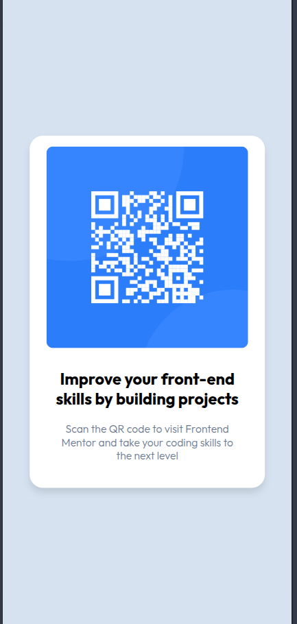

# Frontend Mentor - QR code component solution

This is a solution to the [QR code component challenge on Frontend Mentor](https://www.frontendmentor.io/challenges/qr-code-component-iux_sIO_H). Frontend Mentor challenges help you improve your coding skills by building realistic projects.

## Table of contents

- [Overview](#overview)
  - [Screenshot](#screenshot)
  - [Links](#links)
- [My process](#my-process)
  - [Built with](#built-with)
  - [What I learned](#what-i-learned)
  - [AI Collaboration](#ai-collaboration)

## Overview

QRCode-Component Design Implementation was really an amazing task to replenish my html and css core knowledge.

Here's my journey:

### Screenshot




### Links

- Live Site URL:(https://qrcode-comp-design.netlify.app/)

## My process

- The thought process behind was simple, here's the overview:

- Structure first with html -> Apply CSS from top to bottom -> Check for responsiveness

### Built with

- Semantic HTML5 markup
- CSS custom properties
- Flexbox
- Mobile-first workflow

### What I learned

Here are my major learnings:

Look at how I structured my html, keeping in mind semantics and followed conventions.

```html
<!-- Main section -->
<main>
  <!-- Container -->
  <div class="container">
    <!-- QR Code Image -->
    
    <!-- Title -->
    <h1 class="title">Improve your front-end skills by building projects</h1>
    <!-- Description -->
    <p class="description">
      Scan the QR code to visit Frontend Mentor and take your coding skills to
      the next level
    </p>
  </div>
</main>
```

Refreshed how to center a div, the parent and child relationship.

```css
body {
  background-color: #d6e2f0;
  min-height: 100vh;
  display: flex;
  flex-direction: column;
  justify-content: center;
  align-items: center;
}
```

The box-shadow property:

```css
{box-shadow: 0px 8px 10px rgba(0, 0, 0, 0.1);}
```

### AI Collaboration

I used GitHub Copilot for the following learnings:

- How to structure HTML properly (to check it!)
- Different CSS properties
- Centering a div and the parent-child relation
